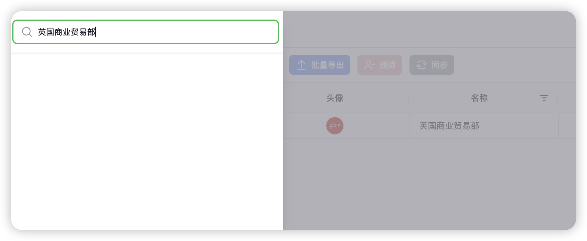
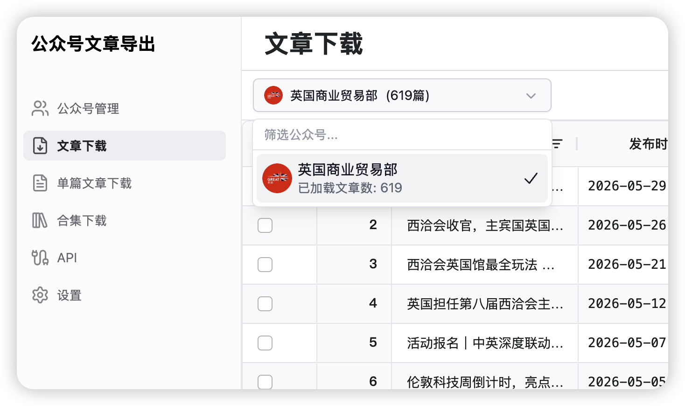
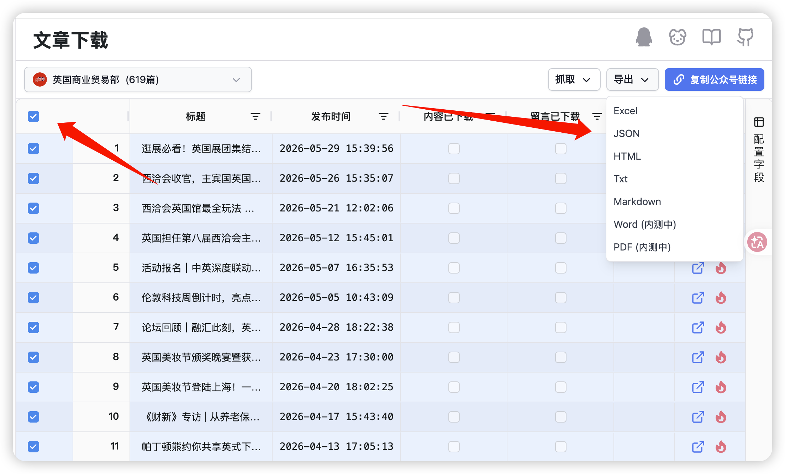

# How to use wechat-article-exporter

1. ***登录*** (Log in, ensure the Login account has one official account permission)
2. ***进行授权*** (Authorization)
3. ***进入’设置’ -> 配置代理节点*** (Go to 'Settings' -> Configure proxy node)
4. ***进入’公众号管理’ -> 添加*** (Go to 'Official Account Management' -> Add)
5. ***输入需要抓取的公众号名称，如: 英国商业贸易部*** (Enter the name of the official account you wish to scrape, for example: 英国商业贸易部)

6. ***进入‘文章下载’ -> 选择公众号*** (Enter "Article Download" -> Select the official account)

7. ***全选 -> 导出 JSON*** (Select All -> Export JSON)


# Push command
```bash
git push origin HEAD
git push github HEAD
```